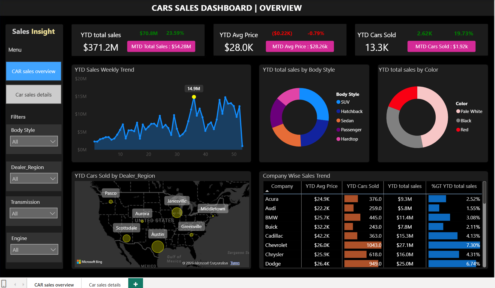

# Car Sales Dashboard
## Tools: Power BI • DAX • Data Modelling

## Objective
Multi-page sales intelligence dashboard tracking $371M in
YTD car sales across 20+ brands and multiple US dealer regions.

## Key metrics
- YTD Sales: $371.2M | MTD: $54.28M | YoY growth: 23.59%
- YTD Cars Sold: 13.3K | Avg Price: $28.0K
- Top brand: Chevrolet (7.3% share, 1,043 units)

## Features
- DAX KPIs: YTD / MTD / YoY / PTYD comparisons
- Weekly sales trend line chart
- Geo map: cars sold by dealer region (USA)
- Body style and colour breakdown (donut charts)
- Company-wise performance matrix with % share
- Drill-through to car-level detail page

## Key findings
- Top brand by units: Chevrolet (1,043 units, $27.1M)
- Top body style: SUV from the donut chart
- Peak sales week: Week 30 ($14.9M spike visible)
